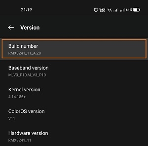
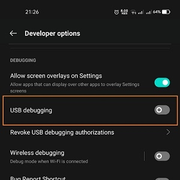
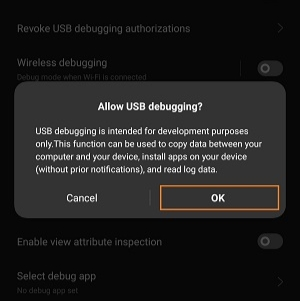

# Sigue estos pasos para conectar tu android y compilar tus apps sin cables 💁‍♂️

> Antes de empezar debes instalar el [SDK platform tools](https://developer.android.com/studio/releases/platform-tools).

## <spam style="color:#93ddfb">1 - </spam> CONFIGURA TU DISPOSITIVO📱
Ve a **configuraciones** de tu android y activa el modo **desarrollador**, ve a información de tu dispositivo y en **número de compilación** vas a tocar hasta que te salga un mensaje que se **activó** el modo desarrollador.
<p style="width:250px; display:inline" align="center">
  
</p>

Una vez activado vas a ir a esa **nueva** opción desbloqueada y vas a buscar <spam style="color:#93ddfb"><b>Depuración USB</b></spam>, la activas y listo.

<p style="width:250px; display:inline" align="center">
     <br>
    
</p>

## <spam style="color:#93ddfb">2 - </spam> EJECUTA EL SCRIPT

> Vamos a hacer esto una única vez, con la **depuración usb** activada, conecta tu dispositivo a la pc por cable.

Ejecuta este comando teniendo en cuenta el mensaje de arriba, pero antes hazle unos pequeños cambios a este código.
* En la segunda linea cambia la ruta por la dirección donde tienes instalado tu **SDK platform tools**.
* En la linea **10** donde dice **your.device.ip.adress** cambialo por la dirección IP de tu celular.

Guarda los cambios y listo, ejecuta este script con el celular conectado por USB, desconectalo y a compilar! 😎

descargar <spam style="color:#93ddfb"><b><a href="https://gitlab.com/Tomvargas/assets-vape/-/raw/main/connect.bat?inline=false" download>connect.bat</a></b></spam>
```bash
REM Change the following command to the path of your sdk on platform tools
cd C:\Users\User\AppData\Local\Android\Sdk\platform-tools
adb usb
pause

adb tcpip 5555
pause

REM change the following command to ip of your android device
adb connect your.device.ip.adress
adb devices

REM thanks for using follow me on github @tomvargas
pause
exit
```

<span style="color:#93ddfb">@author </span>Tomás Vargas

> Si te gustó este contenido no dudes en seguirme en mis redes sociales, puedes instalar mi página como si de una app se tratase y estar al día de las nuevas publicaciones ☝️